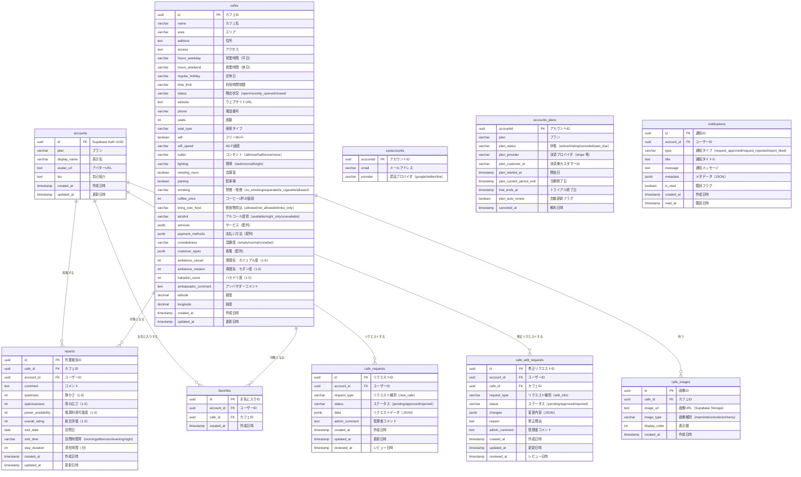

# ハカドルカフェ データベース設計（ER 図）

**作成日**: 2025-11-01
**バージョン**: 1.0

---

## 概要

このドキュメントでは、ハカドルカフェアプリケーションのデータベース設計を定義します。
Supabase（PostgreSQL）を使用し、以下のエンティティで構成されます。

---

## ER 図（Mermaid）

---

## テーブル詳細

### 1. accounts（ユーザー）

| カラム名     | 型           | 制約                    | 説明                                  |
| ------------ | ------------ | ----------------------- | ------------------------------------- |
| id           | uuid         | PK                      | Supabase Auth のユーザー UUID         |
| email        | varchar(255) | NOT NULL, UNIQUE        | メールアドレス                        |
| display_name | varchar(100) |                         | 表示名                                |
| avatar_url   | text         |                         | アバター画像 URL                      |
| bio          | text         |                         | 自己紹介                              |
| provider     | varchar(50)  | NOT NULL                | 認証プロバイダ（google/twitter/line） |
| created_at   | timestamp    | NOT NULL, DEFAULT NOW() | 作成日時                              |
| updated_at   | timestamp    | NOT NULL, DEFAULT NOW() | 更新日時                              |

**インデックス**:

- `idx_accounts_email` ON `email`

---

### 2. cafes（カフェ）

| カラム名           | 型             | 制約                              | 説明                 |
| ------------------ | -------------- | --------------------------------- | -------------------- |
| id                 | uuid           | PK, DEFAULT uuid_generate_v4()    | カフェ ID            |
| name               | varchar(200)   | NOT NULL                          | カフェ名             |
| area               | varchar(100)   | NOT NULL                          | エリア               |
| address            | text           | NOT NULL                          | 住所                 |
| access             | text           |                                   | アクセス情報         |
| hours_weekday      | varchar(100)   |                                   | 営業時間（平日）     |
| hours_weekend      | varchar(100)   |                                   | 営業時間（休日）     |
| regular_holiday    | varchar(100)   |                                   | 定休日               |
| time_limit         | varchar(100)   |                                   | 利用時間制限         |
| status             | varchar(50)    | DEFAULT 'open'                    | 開店状況             |
| website            | text           |                                   | ウェブサイト URL     |
| phone              | varchar(20)    |                                   | 電話番号             |
| seats              | int            |                                   | 席数                 |
| seat_type          | varchar(100)   |                                   | 座席タイプ           |
| wifi               | boolean        | DEFAULT false                     | フリー Wi-Fi         |
| wifi_speed         | varchar(50)    |                                   | Wi-Fi 速度           |
| outlet             | varchar(20)    |                                   | コンセント           |
| lighting           | varchar(20)    |                                   | 照明                 |
| meeting_room       | boolean        | DEFAULT false                     | 会議室               |
| parking            | boolean        | DEFAULT false                     | 駐車場               |
| smoking            | varchar(30)    |                                   | 禁煙・喫煙           |
| coffee_price       | int            |                                   | コーヒー 1 杯の値段  |
| bring_own_food     | varchar(30)    |                                   | 飲食物持込           |
| alcohol            | varchar(30)    |                                   | アルコール提供       |
| services           | jsonb          |                                   | サービス（配列）     |
| payment_methods    | jsonb          |                                   | 支払い方法（配列）   |
| crowdedness        | varchar(20)    |                                   | 混雑度               |
| customer_types     | jsonb          |                                   | 客層（配列）         |
| ambience_casual    | int            | CHECK (1 <= ambience_casual <= 5) | 雰囲気：カジュアル度 |
| ambience_modern    | int            | CHECK (1 <= ambience_modern <= 5) | 雰囲気：モダン度     |
| hakadori_score     | int            | CHECK (1 <= hakadori_score <= 5)  | ハカドリ度           |
| ambassador_comment | text           |                                   | アンバサダーコメント |
| latitude           | decimal(10, 8) |                                   | 緯度                 |
| longitude          | decimal(11, 8) |                                   | 経度                 |
| created_at         | timestamp      | NOT NULL, DEFAULT NOW()           | 作成日時             |
| updated_at         | timestamp      | NOT NULL, DEFAULT NOW()           | 更新日時             |

**インデックス**:

- `idx_cafes_area` ON `area`
- `idx_cafes_location` ON `latitude, longitude` (GiST)
- `idx_cafes_name` ON `name` (GIN for full-text search)

---

### 3. reports（作業報告）

| カラム名           | 型          | 制約                                       | 説明           |
| ------------------ | ----------- | ------------------------------------------ | -------------- |
| id                 | uuid        | PK, DEFAULT uuid_generate_v4()             | 作業報告 ID    |
| cafe_id            | uuid        | FK → cafes(id), NOT NULL                   | カフェ ID      |
| account_id         | uuid        | FK → accounts(id), NOT NULL                | ユーザー ID    |
| comment            | text        |                                            | コメント       |
| quietness          | int         | CHECK (1 <= quietness <= 5)                | 静かさ         |
| spaciousness       | int         | CHECK (1 <= spaciousness <= 5)             | 席の広さ       |
| power_availability | int         | CHECK (1 <= power_availability <= 5)       | 電源利用可能度 |
| overall_rating     | int         | NOT NULL, CHECK (1 <= overall_rating <= 5) | 総合評価       |
| visit_date         | date        |                                            | 訪問日         |
| visit_time         | varchar(20) |                                            | 訪問時間帯     |
| stay_duration      | int         |                                            | 滞在時間（分） |
| created_at         | timestamp   | NOT NULL, DEFAULT NOW()                    | 作成日時       |
| updated_at         | timestamp   | NOT NULL, DEFAULT NOW()                    | 更新日時       |

**インデックス**:

- `idx_reports_cafe_id` ON `cafe_id`
- `idx_reports_account_id` ON `account_id`
- `idx_reports_created_at` ON `created_at DESC`

---

### 4. favorites（お気に入り）

| カラム名   | 型        | 制約                           | 説明          |
| ---------- | --------- | ------------------------------ | ------------- |
| id         | uuid      | PK, DEFAULT uuid_generate_v4() | お気に入り ID |
| account_id | uuid      | FK → accounts(id), NOT NULL    | ユーザー ID   |
| cafe_id    | uuid      | FK → cafes(id), NOT NULL       | カフェ ID     |
| created_at | timestamp | NOT NULL, DEFAULT NOW()        | 作成日時      |

**インデックス**:

- `idx_favorites_account_id` ON `account_id`
- `idx_favorites_cafe_id` ON `cafe_id`
- `unique_account_cafe` UNIQUE ON `account_id, cafe_id`

---

### 5. cafe_requests（カフェ掲載リクエスト）

| カラム名      | 型          | 制約                           | 説明             |
| ------------- | ----------- | ------------------------------ | ---------------- |
| id            | uuid        | PK, DEFAULT uuid_generate_v4() | リクエスト ID    |
| account_id    | uuid        | FK → accounts(id), NOT NULL    | ユーザー ID      |
| request_type  | varchar(50) | NOT NULL                       | リクエスト種別   |
| status        | varchar(20) | NOT NULL, DEFAULT 'pending'    | ステータス       |
| data          | jsonb       | NOT NULL                       | リクエストデータ |
| admin_comment | text        |                                | 管理者コメント   |
| created_at    | timestamp   | NOT NULL, DEFAULT NOW()        | 作成日時         |
| updated_at    | timestamp   | NOT NULL, DEFAULT NOW()        | 更新日時         |
| reviewed_at   | timestamp   |                                | レビュー日時     |

**インデックス**:

- `idx_cafe_requests_account_id` ON `account_id`
- `idx_cafe_requests_status` ON `status`

---

### 6. cafe_edit_requests（カフェ情報修正リクエスト）

| カラム名      | 型          | 制約                           | 説明              |
| ------------- | ----------- | ------------------------------ | ----------------- |
| id            | uuid        | PK, DEFAULT uuid_generate_v4() | 修正リクエスト ID |
| account_id    | uuid        | FK → accounts(id), NOT NULL    | ユーザー ID       |
| cafe_id       | uuid        | FK → cafes(id), NOT NULL       | カフェ ID         |
| request_type  | varchar(50) | NOT NULL                       | リクエスト種別    |
| status        | varchar(20) | NOT NULL, DEFAULT 'pending'    | ステータス        |
| changes       | jsonb       | NOT NULL                       | 変更内容          |
| reason        | text        |                                | 修正理由          |
| admin_comment | text        |                                | 管理者コメント    |
| created_at    | timestamp   | NOT NULL, DEFAULT NOW()        | 作成日時          |
| updated_at    | timestamp   | NOT NULL, DEFAULT NOW()        | 更新日時          |
| reviewed_at   | timestamp   |                                | レビュー日時      |

**インデックス**:

- `idx_cafe_edit_requests_account_id` ON `account_id`
- `idx_cafe_edit_requests_cafe_id` ON `cafe_id`
- `idx_cafe_edit_requests_status` ON `status`

---

### 7. cafe_images（カフェ画像）

| カラム名      | 型          | 制約                           | 説明      |
| ------------- | ----------- | ------------------------------ | --------- |
| id            | uuid        | PK, DEFAULT uuid_generate_v4() | 画像 ID   |
| cafe_id       | uuid        | FK → cafes(id), NOT NULL       | カフェ ID |
| image_url     | text        | NOT NULL                       | 画像 URL  |
| image_type    | varchar(20) | NOT NULL                       | 画像種別  |
| display_order | int         | DEFAULT 0                      | 表示順    |
| created_at    | timestamp   | NOT NULL, DEFAULT NOW()        | 作成日時  |

**インデックス**:

- `idx_cafe_images_cafe_id` ON `cafe_id`
- `idx_cafe_images_display_order` ON `cafe_id, display_order`

---

### 8. notifications（通知）

| カラム名   | 型          | 制約                           | 説明           |
| ---------- | ----------- | ------------------------------ | -------------- |
| id         | uuid        | PK, DEFAULT uuid_generate_v4() | 通知 ID        |
| account_id | uuid        | FK → accounts(id), NOT NULL    | ユーザー ID    |
| type       | varchar(50) | NOT NULL                       | 通知タイプ     |
| title      | text        | NOT NULL                       | 通知タイトル   |
| message    | text        | NOT NULL                       | 通知メッセージ |
| metadata   | jsonb       |                                | メタデータ     |
| is_read    | boolean     | NOT NULL, DEFAULT false        | 既読フラグ     |
| created_at | timestamp   | NOT NULL, DEFAULT NOW()        | 作成日時       |
| read_at    | timestamp   |                                | 既読日時       |

**インデックス**:

- `idx_notifications_account_id` ON `account_id`
- `idx_notifications_is_read` ON `account_id, is_read`
- `idx_notifications_created_at` ON `created_at DESC`

---

## Row Level Security (RLS) ポリシー

Supabase では、Row Level Security（RLS）を使用して、データアクセスを制御します。

### accounts テーブル

- **SELECT**: すべてのユーザーが自分の情報を閲覧可能
- **UPDATE**: ユーザーは自分の情報のみ更新可能

### cafes テーブル

- **SELECT**: すべてのユーザー（未ログインを含む）が閲覧可能
- **INSERT/UPDATE/DELETE**: 管理者のみ（別プロジェクトで管理）

### reports テーブル

- **SELECT**: すべてのユーザーが閲覧可能
- **INSERT**: ログインユーザーのみ
- **UPDATE/DELETE**: 自分の投稿のみ

### favorites テーブル

- **SELECT**: 自分のお気に入りのみ閲覧可能
- **INSERT/DELETE**: 自分のお気に入りのみ操作可能

### cafe_requests / cafe_edit_requests テーブル

- **SELECT**: 自分のリクエストのみ閲覧可能
- **INSERT**: ログインユーザーのみ
- **UPDATE/DELETE**: 管理者のみ（別プロジェクト）

### notifications テーブル

- **SELECT**: 自分の通知のみ閲覧可能
- **UPDATE**: 自分の通知のみ更新可能（既読フラグなど）

---

## 備考

- **管理者画面は別プロジェクト**のため、本プロジェクトでは RLS ポリシーで管理者機能を制限
- **画像は Supabase Storage**に保存し、URL をテーブルに保存
- **JSONB 型**を活用して柔軟なデータ構造を実現（services, payment_methods, customer_types 等）
- **位置情報検索**は PostGIS または Supabase の GiST index を活用
