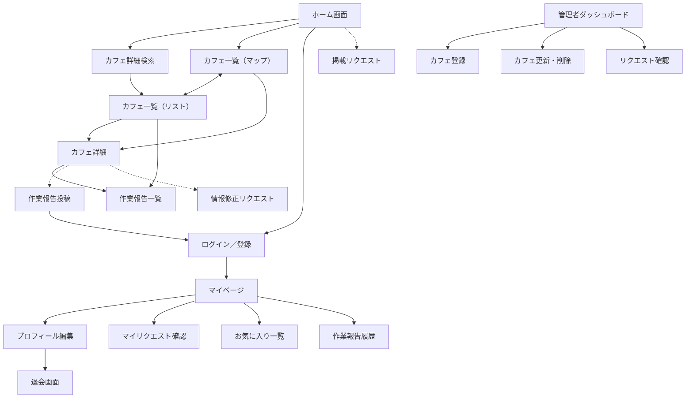

#  機能定義書（Functional Specification）

**アプリ名：ハカドルカフェ（Hakadoru Café）**  
**作成日：2025年11月1日**  

---

## 1. アプリ概要

「ハカドルカフェ」は、**“集中 × リラックス”** を両立した作業カフェを見つけるためのアプリケーションである。  
カフェの座席環境、Wi-Fiや電源の有無、混雑度、雰囲気など、  
「作業が捗る」ために必要な情報を網羅的に提供し、直感的なマップUIで検索できる。

---

## 2. 目的

- 作業・勉強・副業に適したカフェを**効率的に発見**できるようにする  
- 一般的なグルメサイトやマップでは得られない**作業特化情報**を提供する  
- 「居心地」「静けさ」「開放感」などの**心理的快適性**も考慮したカフェ選びを支援する  

---

## 3. 想定ユーザー

| 区分 | 特徴 |
|------|------|
| 学生・社会人 | 自習や資格勉強をしたい |
| フリーランス | コワーキング代わりに利用したい |
| 副業・クリエイター | 仕事後や休日に作業したい |
| カフェ巡り層 | おしゃれかつ集中できる空間を探したい |

---

## 4. 機能一覧

| No | カテゴリ | 機能名 | 概要 | 未ログインユーザ | ログインユーザ | MVP必要性 |
|----|---|---------|------|-|-|------------|
| 1 | カフェ検索| カフェ検索結果表示（マップ） | カフェ条件検索の結果を位置情報ベースでカフェをマップ上に表示。指定した範囲内のカフェを視覚的に検索可能。ワンタップでリスト表示と切り替え可能。 |⚪︎|⚪|⚪|
| 2 | カフェ検索| カフェ検索結果表示（リスト） | カフェ条件検索の結果をカフェ情報カードベースでカフェをリストとして表示。ワンタップでリスト表示と切り替え可能。ワンタップでマップ表示と切り替え可能 |⚪︎|⚪|⚪|
| 3 | カフェ検索 | カフェ検索条件検索 | キーワードや条件で絞り込み検索可能。 |⚪︎|⚪︎|⚪|
| 4 | カフェ詳細表示 |カフェ詳細表示 | 各カフェの詳細情報（Wi-Fi・電源・席の広さ・静かさ・価格帯・滞在制限など）を表示。|⚪︎|⚪︎|⚪|
| 5 | 作業報告 | 作業報告投稿 | 実際に訪れたユーザーが「作業報告」としてレビューを投稿できる。 |×|⚪︎|⚪|
| 6 | 作業報告 | 作業報告閲覧 | 投稿された「作業報告」を確認できる。 |⚪︎|⚪︎|⚪|
| 7 | カフェ掲載 | カフェ掲載リクエスト | 店舗運営者またはユーザーが新規カフェ情報について登録申請できる。 |×|⚪︎|⚪|
| 8 | カフェ掲載 | カフェ情報修正リクエスト | 店舗運営者またはユーザーが既存カフェ情報について修正リクエストができる。 |×|⚪︎|⚪|
| 9 | 管理者 | カフェ登録 | ハカドルカフェに掲載するカフェを新規登録できる |×|×|⚪|
| 10 | 管理者 | カフェ更新・削除 | カフェ情報の更新および掲載削除ができる |×|×|⚪|
| 11 | 管理者 | リクエスト確認 | カフェ掲載リクエストを確認できる。 |×|×|⚪|
| 12 | マイページ | お気に入り機能 | お気に入りカフェの登録・確認ができる。 |×|⚪︎|⚪|
| 13 | マイページ | 作業報告確認機能 | 自分の投稿した作業報告を確認できる |×|⚪︎|⚪|
| 14 | マイページ | マイリクエスト確認機能 | 自分のリクエストについて状態を確認できる |×|⚪︎|⚪|
| 15 | 認証・認可 | アカウント登録 | Google／X（Twitter）／LINEアカウント情報からアカウント新規登録ができる。 |⚪︎|×|⚪|
| 16 | 認証・認可 | ログイン／認証 | Google／X（Twitter）／LINE認証でのSSOログインができる。 |×|⚪︎|⚪|
| 17 | 認証・認可 | 認可 | 課金ユーザ向けの機能解放ができる |×|⚪︎|×|
| 18 | 決済 | 決済 | ユーザからの課金・決済ができる。 |×|⚪︎|×|
| 19 | 通知 | プッシュ通知 | イベント発生時にユーザにプッシュ通知ができる。 |×|⚪︎|×|
| 20 | 通知 | 通知確認 | 通知内容を確認できる |×|⚪︎|×|

---

これらにより、**「信頼できるカフェ情報 × 作業体験共有」** のコア体験を成立させる。

# ☕ カフェ詳細情報項目一覧（カテゴリ・優先度順）

---

## 🏠 基本情報（Basic Info）
| 項目 | 型 | 候補／例 | 表示目的 |
|------|----|-----------|------------|
| カフェ名 | text | 例：Blue Bottle Coffee 日本橋店 | 店舗識別の中心。検索・一覧表示の主キー。 |
| エリア | select | 日本橋／渋谷／新宿など | 地域別フィルタ・ランキング表示に利用。 |
| 住所 | text | 東京都中央区〜 | Googleマップ連携・アクセス案内用。 |
| アクセス | text | 日本橋駅A5出口 徒歩3分 | 最寄駅・所要時間の明示。 |
| 営業時間 | text | 8:00〜21:00（L.O. 20:30） | 来店可否判断。休日と分けて表示可。 |
| 定休日 | text | 火曜日 | 休業情報。来店ミス防止。 |
| 利用時間制限 | text | 2時間制／制限なし | 長居可否・作業向き度の判断。 |
| 開店状況 | select | 開店／最近オープン／閉店 | 情報鮮度・注目店表示。 |
| ウェブサイト | url | https://〜 | 店舗公式ページ・SNS誘導。 |
| 電話番号 | text | 03-XXXX-XXXX | 予約・問い合わせ用。 |

---

## 💺 環境・設備（Environment & Facility）
| 項目 | 型 | 候補／例 | 表示目的 |
|------|----|-----------|------------|
| 席数 | number | 42 | 店舗規模・混雑予測。 |
| 座席タイプ | select | ソファ／木製／ベンチ／ミックス | 滞在快適性。 |
| フリーWi-Fi | select | あり／なし | 作業可否の判断。 |
| Wi-Fi速度 | text | 上り45Mbps／下り80Mbps | オンライン作業の参考。 |
| コンセント | select | 全席あり／8割／5割／3割／一部／なし | 電源確保可否。 |
| 照明 | select | 暗め／普通／明るめ | 文字・画面見やすさ指標。 |
| 会議室 | select | あり／なし | 打ち合わせ利用可否。 |
| 駐車場 | select | あり／なし | 車利用者向け情報。 |
| 禁煙・喫煙 | select | 全席禁煙／分煙／電子タバコ可／喫煙可 | 快適性・健康配慮表示。 |

---

## 🍰 サービス・メニュー（Service & Menu）
| 項目 | 型 | 候補／例 | 表示目的 |
|------|----|-----------|------------|
| コーヒー1杯の値段 | number | 650 | 作業単価・コスパ比較。 |
| 飲食物持込可否 | select | 可能／不可／飲み物のみ可 | 利用ポリシー明示。 |
| アルコール提供 | select | あり／夜のみあり／なし | カフェバー兼用可否。 |
| サービス | multi_select | ペットOK／子連れOK／テラス席あり／テイクアウト／24h営業／個室ブース／窓際席あり／デカフェあり／モニター貸出あり | 利用シーン拡張。 |
| 支払い方法 | multi_select | 現金／クレカ／QR決済／交通系IC／QuicPay | 決済対応幅。 |

---

## 👥 利用傾向・作業環境（User & Work Conditions）
| 項目 | 型 | 候補／例 | 表示目的 |
|------|----|-----------|------------|
| 混雑度 | select | 空いている／普通／混んでいる | 時間帯別来店判断。 |
| 客層 | multi_select | 学生／ビジネス／ファミリー／観光客／地元 | 店内雰囲気・静けさ予測。 |

---

## 🌿 雰囲気・デザイン（Ambience & Design）
| 項目 | 型 | 候補／例 | 表示目的 |
|------|----|-----------|------------|
| 雰囲気1（カジュアル／フォーマル） | select（1〜5） | カジュアル3 | 客層・用途イメージ。 |
| 雰囲気2（レトロ／モダン） | select（1〜5） | モダン4 | インテリアスタイル把握。 |

---

## 総評
| 項目 | 型 | 候補／例 | 表示目的 |
|------|----|-----------|------------|
| ハカドリ度 | select（1〜5） | ★★★★☆ | 「作業が捗る」総合評価。UI上は星表示。 |
| アンバサダーコメント | text | 「静かで天井が高く集中できる。午前中がおすすめ。」 | 店舗の実感レビュー。 |

## 🧾 管理・メタ情報（Meta Info）
| 項目 | 型 | 候補／例 | 表示目的 |
|------|----|-----------|------------|
| 最終更新日 | date | 2025-11-01 | 情報鮮度の明示。 |

## **画面一覧（トップレベル構成）**

| 画面カテゴリ | 画面名 | 目的 |
| --- | --- | --- |
| **ホーム** | ホーム画面 | カフェ検索（マップ）・条件検索への起点となる。現在地や人気カフェのピックアップを表示。 |
| **カフェ検索** | カフェ詳細検索画面 | 地域・設備・雰囲気・混雑度などの条件を指定して検索を行う。 |
| **カフェ検索結果** | カフェ一覧画面（マップ） | 現在地や指定エリアのカフェを地図上に直感的に表示する。ピンをクリックすると詳細を開く。 |
|  | カフェ一覧画面（リスト） | 条件・キーワード検索の結果を一覧形式で表示する。ソートやフィルタも可能。 |
| **カフェ詳細** | カフェ詳細画面 | 各カフェの基本情報、写真、Wi-Fi・電源有無、作業報告、マップ位置などを閲覧できる。 |
| **作業報告** | 作業報告投稿画面 | 実際に訪れたユーザーが作業環境（静けさ・席の広さ・滞在可否など）を投稿する。 |
|  | 作業報告一覧画面 | 各カフェまたは全体の作業報告を閲覧し、他ユーザーの評価を参照できる。 |
| **カフェ掲載** | 掲載リクエスト画面 | ユーザーまたは店舗側が新規カフェ情報を申請できる。 |
|  | 情報修正リクエスト画面 | 掲載中カフェ情報の誤りをユーザーが修正リクエストできる。 |
| **マイページ** | マイページ画面 | 自分の作業報告・お気に入り・通知履歴などを一括で確認できる。 |
|  | プロフィール編集画面 | 自身のユーザー名・アイコン・自己紹介などを編集できる。 |
|  | マイリクエスト確認画面 | 自身のリクエスト状態を確認できる。 |
|  | 退会画面 | アカウント削除（退会）処理を行う。確認ダイアログ付き。 |
| **認証・認可** | ログイン／登録画面 | Google／X（Twitter）／LINEを利用したSSOログインを行う。 |
|  | 認可・決済設定画面 | プレミアムプラン登録や決済履歴を確認できる。Stripe等を想定。 |
| **管理者** | 管理者ダッシュボード | 登録済みカフェの一覧を確認し、ステータス管理を行う。 |
|  | カフェ登録画面 | 管理者が新規カフェを手動登録する。 |
|  | カフェ更新・削除画面 | 管理者が既存カフェを編集・削除する。 |
|  | リクエスト確認画面 | ユーザーからの掲載・修正リクエストを承認／却下できる。 |
| **通知** | 通知一覧画面 | 新着通知（掲載承認・レポート反応など）を時系列で確認する。 |
|  | プッシュ通知設定画面 | 通知のON／OFFを切り替える。ブラウザ・アプリ別設定を想定。 |

---

## **画面遷移図**
（凡例）
 - 破線：未ログイン時はログイン画面に遷移させる

---
